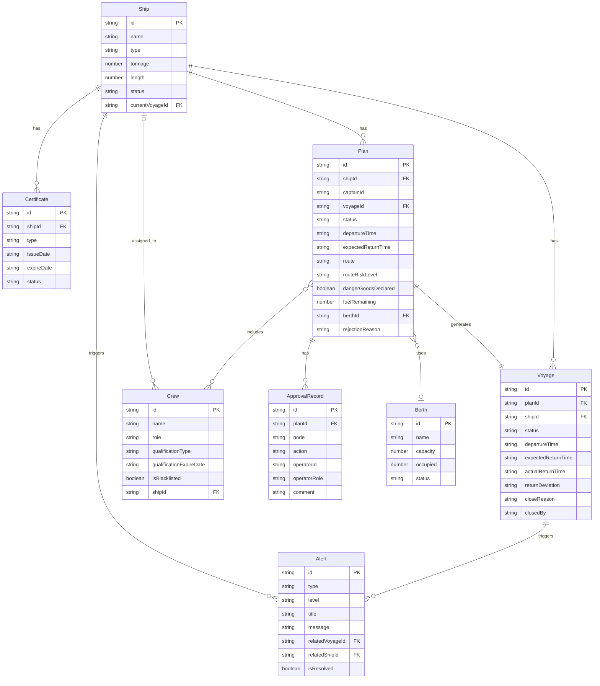

## 1. 架构设计

```mermaid
graph TB
    subgraph "前端层"
        "React SPA" --> "API Client"
    end
    subgraph "后端层"
        "Express API" --> "业务服务层"
        "业务服务层" --> "数据访问层"
    end
    subgraph "数据层"
        "SQLite 数据库"
    end
    "API Client" -->|"HTTP/JSON"| "Express API"
    "数据访问层" --> "SQLite 数据库"
```

前后端分离架构，前端 React SPA 通过 API Client 调用后端 Express REST API，后端采用三层架构（路由→服务→仓库），SQLite 单文件数据库持久化。

## 2. 技术说明

- **前端**：React@18 + TypeScript + TailwindCSS@3 + Vite + Recharts（图表）+ React Router@6
- **初始化工具**：Vite (react-ts template)
- **后端**：Express@4 + TypeScript + better-sqlite3
- **数据库**：SQLite（单文件，容器友好）
- **容器化**：Docker + docker-compose（前后端+数据库一体镜像）

## 3. 路由定义

| 路由 | 用途 |
|------|------|
| `/` | 值班大屏（默认首页） |
| `/plans` | 出港计划列表 |
| `/plans/new` | 创建出港计划 |
| `/plans/:id` | 计划详情（含审批流） |
| `/voyages/:id` | 航次详情（含时间线） |
| `/ships` | 船舶档案列表 |
| `/ships/:id` | 船舶详情（含证书） |
| `/crew` | 船员管理 |
| `/berths` | 泊位管理 |
| `/alerts` | 预警中心 |
| `/statistics` | 统计看板 |

## 4. API 定义

### 4.1 认证

```
POST /api/auth/login     → { token, user }
GET  /api/auth/me        → { user }
```

### 4.2 出港计划

```
GET    /api/plans                → Plan[]
POST   /api/plans                → Plan
GET    /api/plans/:id            → PlanDetail
PUT    /api/plans/:id            → Plan
POST   /api/plans/:id/submit     → Plan (提交审批)
POST   /api/plans/:id/withdraw   → Plan (撤回)
POST   /api/plans/:id/review     → Plan (值班员复核)
POST   /api/plans/:id/inspect    → Plan (监管员抽查)
POST   /api/plans/:id/release    → Plan (码头放行)
POST   /api/plans/:id/reject     → Plan (打回)
POST   /api/plans/:id/revoke     → Plan (撤销放行)
```

### 4.3 航次

```
GET    /api/voyages              → Voyage[]
GET    /api/voyages/:id          → VoyageDetail
POST   /api/voyages/:id/return   → Voyage (返港登记)
POST   /api/voyages/:id/review-return → Voyage (异常返港复核)
POST   /api/voyages/:id/close    → Voyage (关闭航次)
```

### 4.4 船舶

```
GET    /api/ships                → Ship[]
GET    /api/ships/:id            → ShipDetail
POST   /api/ships                → Ship
PUT    /api/ships/:id            → Ship
GET    /api/ships/:id/certificates → Certificate[]
POST   /api/ships/:id/certificates → Certificate
```

### 4.5 船员

```
GET    /api/crew                 → Crew[]
POST   /api/crew                 → Crew
PUT    /api/crew/:id             → Crew
PUT    /api/crew/:id/blacklist   → Crew (加入/移出黑名单)
```

### 4.6 泊位

```
GET    /api/berths               → Berth[]
PUT    /api/berths/:id           → Berth
```

### 4.7 预警

```
GET    /api/alerts               → Alert[]
PUT    /api/alerts/:id/resolve   → Alert (处置)
GET    /api/weather              → WeatherInfo
```

### 4.8 统计

```
GET    /api/statistics/overview  → OverviewStats
GET    /api/statistics/trends    → TrendData[]
GET    /api/statistics/compliance → ComplianceStats
```

### 4.9 审计

```
GET    /api/audit/approval-chain/:planId → ApprovalRecord[]
GET    /api/audit/release-log            → ReleaseLog[]
GET    /api/audit/revoke-log             → RevokeLog[]
```

### 4.10 类型定义

```typescript
interface Plan {
  id: string
  shipId: string
  captainId: string
  voyageId?: string
  status: 'draft' | 'submitted' | 'reviewing' | 'inspecting' | 'released' | 'rejected' | 'revoked' | 'withdrawn'
  departureTime: string
  expectedReturnTime: string
  route: string
  routeRiskLevel: 'low' | 'medium' | 'high'
  dangerGoodsDeclared: boolean
  dangerGoodsDetail?: string
  fuelRemaining: number
  crewIds: string[]
  berthId?: string
  rejectionReason?: string
  createdAt: string
  updatedAt: string
}

interface Voyage {
  id: string
  planId: string
  shipId: string
  status: 'active' | 'returning' | 'abnormal_return' | 'closed'
  departureTime: string
  expectedReturnTime: string
  actualReturnTime?: string
  returnDeviation?: string
  closeReason?: string
  closedBy?: string
  closedAt?: string
  createdAt: string
}

interface ApprovalRecord {
  id: string
  planId: string
  node: 'auto_check' | 'duty_review' | 'supervisor_inspect' | 'dock_release'
  action: 'approved' | 'rejected' | 'revoked'
  operatorId: string
  operatorRole: string
  comment?: string
  createdAt: string
}

interface Ship {
  id: string
  name: string
  type: string
  tonnage: number
  length: number
  status: 'in_port' | 'at_sea' | 'maintenance'
  currentVoyageId?: string
  createdAt: string
}

interface Certificate {
  id: string
  shipId: string
  type: string
  issueDate: string
  expireDate: string
  status: 'valid' | 'expiring_soon' | 'expired'
}

interface Crew {
  id: string
  name: string
  role: string
  qualificationType: string
  qualificationExpireDate: string
  isBlacklisted: boolean
  shipId?: string
}

interface Berth {
  id: string
  name: string
  capacity: number
  occupied: number
  status: 'available' | 'occupied' | 'reserved' | 'maintenance'
}

interface Alert {
  id: string
  type: 'weather' | 'return_timeout' | 'cert_expire' | 'route_risk' | 'abnormal_release'
  level: 'critical' | 'warning' | 'info'
  title: string
  message: string
  relatedVoyageId?: string
  relatedShipId?: string
  isResolved: boolean
  createdAt: string
}
```

## 5. 服务端架构图

```mermaid
graph LR
    "路由层 Routes" --> "控制器层 Controllers"
    "控制器层 Controllers" --> "服务层 Services"
    "服务层 Services" --> "仓库层 Repositories"
    "仓库层 Repositories" --> "SQLite"
    "服务层 Services" --> "校验器 Validators"
    "服务层 Services" --> "审计记录器 AuditLogger"
```

## 6. 数据模型

### 6.1 数据模型定义



### 6.2 数据定义语言

```sql
CREATE TABLE users (
    id TEXT PRIMARY KEY,
    username TEXT NOT NULL UNIQUE,
    password TEXT NOT NULL,
    role TEXT NOT NULL CHECK(role IN ('captain','duty_officer','supervisor','admin')),
    name TEXT NOT NULL,
    created_at TEXT NOT NULL DEFAULT (datetime('now'))
);

CREATE TABLE ships (
    id TEXT PRIMARY KEY,
    name TEXT NOT NULL,
    type TEXT NOT NULL,
    tonnage REAL NOT NULL,
    length REAL NOT NULL,
    status TEXT NOT NULL DEFAULT 'in_port' CHECK(status IN ('in_port','at_sea','maintenance')),
    current_voyage_id TEXT,
    created_at TEXT NOT NULL DEFAULT (datetime('now')),
    updated_at TEXT NOT NULL DEFAULT (datetime('now'))
);

CREATE TABLE certificates (
    id TEXT PRIMARY KEY,
    ship_id TEXT NOT NULL REFERENCES ships(id),
    type TEXT NOT NULL,
    issue_date TEXT NOT NULL,
    expire_date TEXT NOT NULL,
    status TEXT NOT NULL DEFAULT 'valid' CHECK(status IN ('valid','expiring_soon','expired')),
    created_at TEXT NOT NULL DEFAULT (datetime('now'))
);

CREATE TABLE crew (
    id TEXT PRIMARY KEY,
    name TEXT NOT NULL,
    role TEXT NOT NULL,
    qualification_type TEXT NOT NULL,
    qualification_expire_date TEXT NOT NULL,
    is_blacklisted INTEGER NOT NULL DEFAULT 0,
    ship_id TEXT REFERENCES ships(id),
    created_at TEXT NOT NULL DEFAULT (datetime('now')),
    updated_at TEXT NOT NULL DEFAULT (datetime('now'))
);

CREATE TABLE berths (
    id TEXT PRIMARY KEY,
    name TEXT NOT NULL,
    capacity INTEGER NOT NULL,
    occupied INTEGER NOT NULL DEFAULT 0,
    status TEXT NOT NULL DEFAULT 'available' CHECK(status IN ('available','occupied','reserved','maintenance'))
);

CREATE TABLE plans (
    id TEXT PRIMARY KEY,
    ship_id TEXT NOT NULL REFERENCES ships(id),
    captain_id TEXT NOT NULL REFERENCES users(id),
    voyage_id TEXT,
    status TEXT NOT NULL DEFAULT 'draft' CHECK(status IN ('draft','submitted','reviewing','inspecting','released','rejected','revoked','withdrawn')),
    departure_time TEXT NOT NULL,
    expected_return_time TEXT NOT NULL,
    route TEXT NOT NULL,
    route_risk_level TEXT NOT NULL DEFAULT 'low' CHECK(route_risk_level IN ('low','medium','high')),
    danger_goods_declared INTEGER NOT NULL DEFAULT 0,
    danger_goods_detail TEXT,
    fuel_remaining REAL NOT NULL DEFAULT 0,
    berth_id TEXT REFERENCES berths(id),
    rejection_reason TEXT,
    created_at TEXT NOT NULL DEFAULT (datetime('now')),
    updated_at TEXT NOT NULL DEFAULT (datetime('now'))
);

CREATE TABLE plan_crew (
    plan_id TEXT NOT NULL REFERENCES plans(id),
    crew_id TEXT NOT NULL REFERENCES crew(id),
    PRIMARY KEY (plan_id, crew_id)
);

CREATE TABLE voyages (
    id TEXT PRIMARY KEY,
    plan_id TEXT NOT NULL REFERENCES plans(id),
    ship_id TEXT NOT NULL REFERENCES ships(id),
    status TEXT NOT NULL DEFAULT 'active' CHECK(status IN ('active','returning','abnormal_return','closed')),
    departure_time TEXT NOT NULL,
    expected_return_time TEXT NOT NULL,
    actual_return_time TEXT,
    return_deviation TEXT,
    close_reason TEXT,
    closed_by TEXT REFERENCES users(id),
    closed_at TEXT,
    created_at TEXT NOT NULL DEFAULT (datetime('now'))
);

CREATE TABLE approval_records (
    id TEXT PRIMARY KEY,
    plan_id TEXT NOT NULL REFERENCES plans(id),
    node TEXT NOT NULL CHECK(node IN ('auto_check','duty_review','supervisor_inspect','dock_release')),
    action TEXT NOT NULL CHECK(action IN ('approved','rejected','revoked')),
    operator_id TEXT NOT NULL REFERENCES users(id),
    operator_role TEXT NOT NULL,
    comment TEXT,
    created_at TEXT NOT NULL DEFAULT (datetime('now'))
);

CREATE TABLE alerts (
    id TEXT PRIMARY KEY,
    type TEXT NOT NULL CHECK(type IN ('weather','return_timeout','cert_expire','route_risk','abnormal_release')),
    level TEXT NOT NULL CHECK(level IN ('critical','warning','info')),
    title TEXT NOT NULL,
    message TEXT NOT NULL,
    related_voyage_id TEXT REFERENCES voyages(id),
    related_ship_id TEXT REFERENCES ships(id),
    is_resolved INTEGER NOT NULL DEFAULT 0,
    created_at TEXT NOT NULL DEFAULT (datetime('now'))
);

CREATE TABLE release_logs (
    id TEXT PRIMARY KEY,
    plan_id TEXT NOT NULL REFERENCES plans(id),
    ship_id TEXT NOT NULL REFERENCES ships(id),
    operator_id TEXT NOT NULL REFERENCES users(id),
    released_at TEXT NOT NULL DEFAULT (datetime('now'))
);

CREATE TABLE revoke_logs (
    id TEXT PRIMARY KEY,
    plan_id TEXT NOT NULL REFERENCES plans(id),
    release_log_id TEXT NOT NULL REFERENCES release_logs(id),
    operator_id TEXT NOT NULL REFERENCES users(id),
    reason TEXT NOT NULL,
    revoked_at TEXT NOT NULL DEFAULT (datetime('now'))
);

CREATE INDEX idx_plans_status ON plans(status);
CREATE INDEX idx_plans_ship ON plans(ship_id);
CREATE INDEX idx_voyages_status ON voyages(status);
CREATE INDEX idx_voyages_ship ON voyages(ship_id);
CREATE INDEX idx_approval_plan ON approval_records(plan_id);
CREATE INDEX idx_alerts_type ON alerts(type);
CREATE INDEX idx_alerts_resolved ON alerts(is_resolved);
CREATE INDEX idx_certs_ship ON certificates(ship_id);
CREATE INDEX idx_certs_status ON certificates(status);
CREATE INDEX idx_crew_ship ON crew(ship_id);
```
